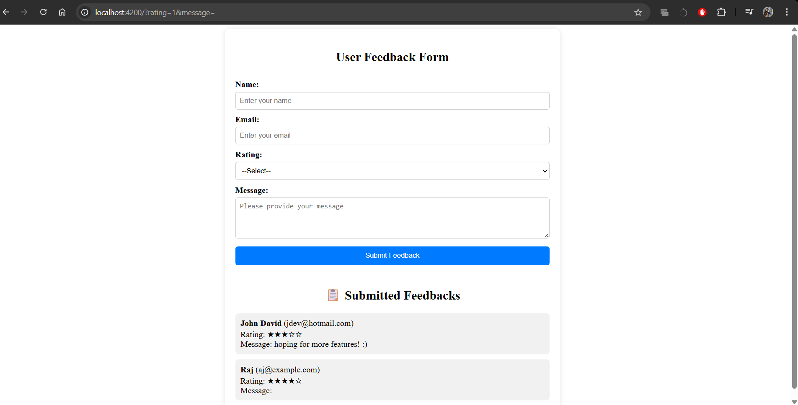

# 📝 User Feedback App (Angular)

This is a simple Angular application that allows users to submit feedback including their name, email, rating, and a message. Feedback is displayed immediately on the page after submission.

---

## 📸 Demo



---

## 🚀 Features

- ✅ User input form with validation
- ✅ Star-based rating selection (1 to 5 stars)
- ✅ Submitted feedbacks displayed in a list
- ✅ Input fields reset after successful submission

---

## 🧰 Tech Stack

- **Frontend**: Angular 16+
- **Styling**: Basic HTML/CSS (customizable)

---

## 🛠️ Getting Started

Follow these steps to run the project locally:

### 1. Clone the repository

```bash
git clone https://github.com/your-username/feedback-app.git
cd feedback-app

```Install dependencies
npm install

````Run the development server
ng serve
```

Once the server is running, open your browser and navigate to `http://localhost:4200/`. The application will automatically reload whenever you modify any of the source files.
